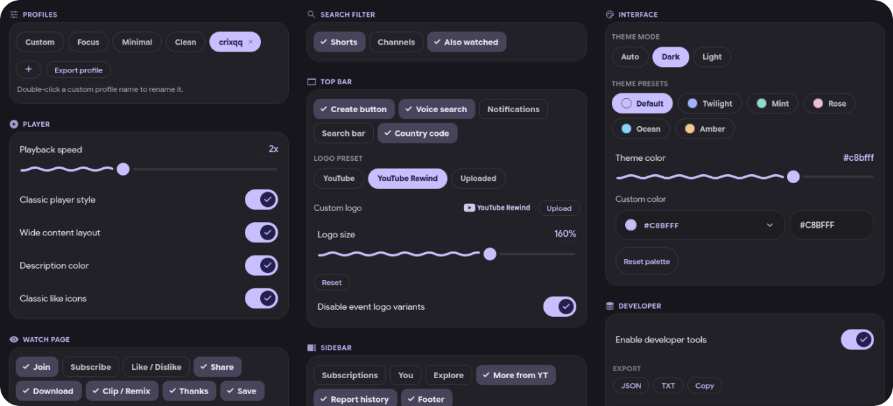

<p align="center">
  <picture>
    <source media="(prefers-color-scheme: dark)" srcset="logo.png">
    <source media="(prefers-color-scheme: light)" srcset="logo.png">
    
  </picture>
</p>

<p align="center">
  <b>Clean up YouTube's interface — hide clutter, filter content, customize the look.</b>
</p>

<p align="center">
  <a href="../../releases"></a>
  <a href="../../releases"></a>
  <a href="https://addons.mozilla.org/firefox/addon/youtube-rewind/"></a>
  <a href="LICENSE"></a>
  <a href="../../stargazers"></a>
</p>

<p align="center">
  <a href="https://addons.mozilla.org/firefox/addon/youtube-rewind/">
    
  </a>
  &nbsp;
  <a href="../../releases">
    
  </a>
  &nbsp;
  <a href="https://t.me/ytrewind_extension">
    
  </a>
</p>

<p align="center">
  
</p>

---

##  Overview

This README has been rechecked against the current `0.5.0` release line, including auto theme mode, linked light/dark palette behavior, fullscreen preview tools, frame screenshots, custom logo media support, hover-preview controls, and beta toggles that can be saved into profiles.

All current features, supported UI languages, installation formats, and release-facing usage notes are listed in this `README.md`.

YouTube Rewind is made for people who want YouTube to feel calmer, cleaner, and more personal without losing the parts that matter.

-  Hide clutter across the homepage, search results, top bar, watch page, and sidebar
-  Save presets and custom profiles, including beta/labs setups
-  Preview thumbnails fullscreen, copy the image or its link, and download it
-  Capture clean video-frame screenshots
-  Customize thumbnails, avatar shapes, banners, player layout, and even the YouTube logo
-  Use the settings UI in 14 languages

> Most settings apply instantly. Changing the language now reloads open YouTube pages so the extension controls and labels refresh consistently.

---

##  Features

<details open>
<summary><b> Profiles</b></summary>

| | |
|---|---|
| **Built-in Profiles** | Instantly apply a preset: Focus (grayscale thumbnails, watch timer), Minimal (aggressive clutter removal), or Clean (light declutter) |
| **Custom Profiles** | Save your current settings as a named profile, import profiles from file, switch between them with one click |
| **Safe Editing** | If you tweak a built-in profile, the extension automatically forks it into a custom profile so the original preset stays intact |
| **Profile Scope** | Custom profiles remember beta/labs options too, so experimental setups can be restored in one tap |

</details>

<details open>
<summary><b> Player</b></summary>

| | |
|---|---|
| **Playback Speed** | Set a default playback speed (0.25x–5.0x) applied to every video |
| **Classic Player** | Brings back the classic gradient under player controls, removes pill-shaped backgrounds, hides quick action buttons above the progress bar |
| **Wide Player** | Removes width limits — player, metadata, and recommendations fill the full page |
| **Disable Description Color** | Removes the adaptive color tint and hover effects from the description area |
| **Classic Like/Dislike Icons** | Replaces YouTube's like/dislike icons with the classic Material Icons thumbs-up/thumbs-down style — works on the watch page, comments, and posts |

</details>

<details open>
<summary><b> Watch Page</b></summary>

| | |
|---|---|
| **Video Buttons** | Hide individual video action buttons: Join, Subscribe, Like/Dislike, Share, Download, Clip/Remix, Thanks, Save |
| **Download Control** | Adds a native-style action near the YouTube buttons to open a thumbnail menu, preview the image fullscreen, copy it, copy its link, and download it |
| **Frame Screenshot** | Capture the current video frame without player chrome, then preview, annotate, copy, or download it |
| **Banner Style** | Change channel banner appearance: default or sharp (no rounding) |

</details>

<details open>
<summary><b> Watch Timer</b></summary>

| | |
|---|---|
| **Session Timer** | Track how long you've been watching YouTube today — displayed as a floating overlay |
| **Daily Time Limit** | Set a daily limit (up to 480 minutes) — get a blocking overlay when you exceed it |
| **Block Repeat Videos** | Optionally prevent rewatching the same video after the time limit is reached |

</details>

<details open>
<summary><b> Homepage</b></summary>

| | |
|---|---|
| **Videos Per Row** | Set how many videos appear per row (1–8), or keep YouTube's default |
| **Content Filter** | Hide Shorts, Posts, Mixes, Breaking News, Latest Posts, Playables, "Explore more topics", "New" badges, and the filter chips bar |

</details>

<details open>
<summary><b> Search</b></summary>

| | |
|---|---|
| **Search Filter** | Hide Shorts, Channels, and "People also watched" shelves from search results |

</details>

<details open>
<summary><b> Top Bar</b></summary>

| | |
|---|---|
| **Hide Elements** | Hide Create button, voice search, search bar, notifications, and country code from the top bar |
| **Logo Variants** | Switch between the native YouTube logo, the built-in YouTube Rewind logo, or your own uploaded image, GIF, or video |
| **Per-Variant Size** | Each logo variant keeps its own size value, so switching presets does not overwrite the others |
| **Hide Logo Animations** | Disable YouTube's event/holiday logo animations (Yoodle) — enabled by default for Rewind and uploaded logos |

</details>

<details open>
<summary><b> Sidebar</b></summary>

| | |
|---|---|
| **Sidebar Filter** | Hide Subscriptions, You, Explore, "More from YouTube", Report history, and footer from the left sidebar |

</details>

<details open>
<summary><b> Appearance</b></summary>

| | |
|---|---|
| **Avatar Shapes** | 12 shapes: circle (default), squircle, rounded square, notched, slanted, arch, square, diamond, hexagon, octagon, clover, flower |
| **Thumbnail Effects** | Reduce distractions: pixelate, blur, grayscale, or hide video thumbnails everywhere (hover reveal is optional, and hover preview can be disabled separately) |
| **Thumbnail Shapes** | Change the shape of video thumbnails: sharp, rounded, squircle, notched, slanted, arch, diamond, hexagon, or octagon |
| **Disable Hover Glow** | Remove the ripple/glow animation on thumbnail hover |

</details>

<details open>
<summary><b> Interface</b></summary>

| | |
|---|---|
| **Theme Mode** | Switch between auto, dark, and light settings themes — auto is the default |
| **Theme Presets & Accent Color** | Pick a built-in palette preset or tune the accent with a custom Material 3 color picker that keeps linked light/dark alternatives coherent |
| **Standalone Workspace** | Open the extension in a responsive full-page workspace from the popup header for easier editing on large screens |

</details>

<details open>
<summary><b> Developer</b></summary>

| | |
|---|---|
| **Developer Tools** | Optional guarded section for advanced maintenance, with a warning before it is enabled |
| **Export / Import** | Export settings as JSON or TXT file with config name metadata, copy to clipboard — import from file (drag & drop) or paste from clipboard |
| **Debug Utilities** | Copy a debug snapshot, clear the update cache, reset watch timer storage, and reload the extension |
| **Reset** | Reset all settings to defaults with confirmation |
| **Update Checker** | Click the version badge — the extension checks for updates from the source it was installed from |

</details>

<details open>
<summary><b> Beta Features</b></summary>

| | |
|---|---|
| **Default Quality** | Experimental preferred video quality override (144p–8K). It is still being tuned because YouTube can ignore or reset quality decisions unexpectedly |
| **Homepage Reveal Animation** | Replays a lightweight entrance animation for homepage cards on load, SPA navigation, and when cards re-enter the viewport |
| **Disable Avatar Live Redirect** | Prevent channel avatar clicks on the homepage from sending you into a live stream |

</details>

---

##  Languages

The extension UI is available in **14 languages** (auto-detected from browser, or pick manually):

`English` `Русский` `Українська` `Español` `Português` `Français` `Deutsch` `Türkçe` `Italiano` `Polski` `Nederlands` `日本語` `한국어` `中文`

---

##  Installation

###  Firefox (Firefox, Zen, Waterfox, LibreWolf)

**Recommended:** Install directly from [Mozilla Add-ons (AMO)](https://addons.mozilla.org/firefox/addon/youtube-rewind/) — automatic updates, no config changes needed.

<details>
<summary><b>Manual installation (unsigned)</b></summary>

1. Open `about:config` and accept the warning
2. Search for `xpinstall.signatures.required` and set it to **false**
3. Download the `.xpi` file from [Releases](../../releases) — Firefox will prompt to install it permanently

This works in all Firefox variants (Firefox, Developer Edition, Nightly, ESR, Zen, Waterfox, LibreWolf).

</details>

###  Chromium (Chrome, Edge, Brave, Opera, Vivaldi, Arc)

Download the `.zip` from [Releases](../../releases).

1. Extract the `.zip` to a folder
2. Open `chrome://extensions`
3. Enable **Developer mode** (top right toggle)
4. Click **Load unpacked** → select the extracted folder

The extension stays active across restarts. Chrome may show a warning on startup — just dismiss it.

> If you need a `.crx` for Chromium forks that support self-signed extensions, you can pack it manually with the browser step below.

<details>
<summary><b>Build from source</b></summary>

```bash
git clone https://github.com/crixqq/YouTube-Rewind.git
cd YouTube-Rewind
pnpm install

pnpm build            # Chrome/Chromium
pnpm build:firefox    # Firefox

pnpm zip              # → .output/youtube-rewind-<ver>-chrome.zip
pnpm zip:firefox      # → .output/youtube-rewind-<ver>-firefox.zip
```

#### Chrome — CRX via browser

1. Build the extension: `pnpm build`
2. Go to `chrome://extensions` → enable **Developer mode**
3. Click **Pack extension** → select `.output/chrome-mv3` as the root directory
4. Chrome generates a `.crx` file and a `.pem` private key (keep the key for future updates)

#### Firefox — XPI via web-ext

```bash
pnpm add -D web-ext
npx web-ext build --source-dir .output/firefox-mv2
```

The `.xpi` file will be in the `web-ext-artifacts/` folder. To sign it for permanent installation, use [`web-ext sign`](https://extensionworkshop.com/documentation/develop/getting-started-with-web-ext/#signing-your-extension-for-self-distribution) with your AMO credentials.

</details>

---

##  How It Works

The extension injects CSS into YouTube and uses `data-*` attributes on `<html>` to toggle styles. Settings are saved to `browser.storage.local` — the content script updates attributes instantly, no reload required.

For things CSS can't handle (like "Explore more topics"), a lightweight MutationObserver tags matching elements so CSS can hide them.

---

##  Tech Stack

[WXT](https://wxt.dev) &middot; [Svelte 5](https://svelte.dev) &middot; CSS injection via manifest &middot; `browser.storage.local`

---

<p align="center">
  <a href="LICENSE">GPL-3.0</a> &middot; made by <a href="https://github.com/crixqq">crixqq</a>
</p>
