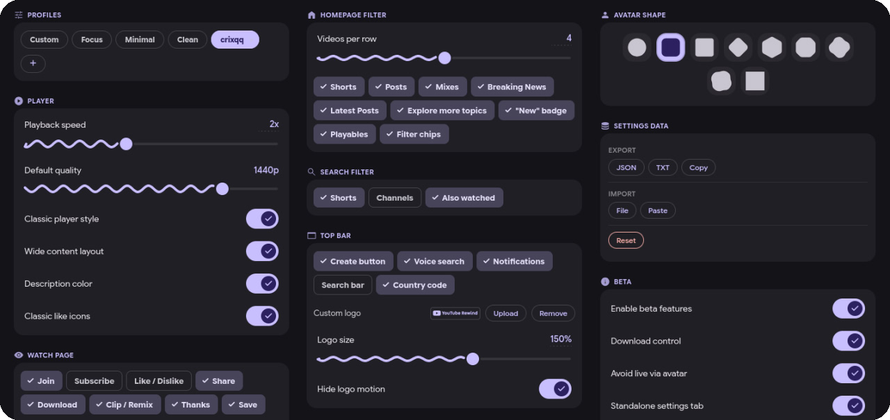

# YouTube Rewind

<p align="center">
  
</p>

<p align="center">
  <b>A calmer, sharper YouTube with practical tools for watching, researching, and creating.</b>
</p>

<p align="center">
  <a href="package.json"></a>
  <a href="../../releases"></a>
  <a href="https://addons.mozilla.org/firefox/addon/youtube-rewind/"></a>
  <a href="LICENSE"></a>
</p>

<p align="center">
  <a href="https://addons.mozilla.org/firefox/addon/youtube-rewind/"></a>
  <a href="https://chromewebstore.google.com/detail/youtube-rewind/mafjipbkleeooghlebgipkcbcggpojma"></a>
  <a href="../../releases"></a>
</p>

<p align="center">
  
</p>

## Why It Exists

YouTube Rewind is for people who want YouTube to feel less noisy without giving up power tools. It cleans the interface, lets you save profiles, improves the player, adds creator utilities, and includes an optional AI assistant for understanding the current video.

## Killer Features

- **Cleaner YouTube:** hide Shorts, posts, mixes, sidebars, top-bar clutter, watch-page buttons, badges, chips, and recommendations you do not want.
- **Adaptive homepage grid:** choose the target number of videos per row for Full HD; the grid automatically reduces columns on smaller screens to keep thumbnails comfortable.
- **Profiles:** switch between Focus, Minimal, Clean, Default, and your own imported/exported profiles.
- **Better player:** default speed, Ctrl + wheel speed changes, auto-skip of YouTube's Skip button, wide player, classic player styling, and clean frame screenshots.
- **Thumbnail and channel tools:** preview/download thumbnails, channel avatars, and banners; open compact stats shortcuts for channels and videos.
- **Video Sense AI:** ask about the current video using title, description, visible comments, checked links, channel context, optional web snippets, and optional YouTube/Gemini page summary.
- **Custom look:** thumbnail effects, avatar and thumbnail shapes, custom logo, theme presets, and accent colors.

The complete feature list lives in [FEATURES.md](FEATURES.md).

## Privacy

Most features run locally in the browser. Video Sense AI is optional and disabled by default. When enabled and used, video context, your prompt, selected links, transcript/page summary text, and web snippets may be sent to the AI provider you selected. API keys are stored locally in browser extension storage and are sent only to the selected provider endpoint for your request.

Read the full policy in [docs/privacy-policy.md](docs/privacy-policy.md).

## Languages

The settings UI supports English, Russian, Ukrainian, Spanish, Portuguese, French, German, Turkish, Italian, Polish, Dutch, Japanese, Korean, and Chinese, with English fallback for any missing string.

## Installation

### Firefox

Install from [Mozilla Add-ons](https://addons.mozilla.org/firefox/addon/youtube-rewind/) for automatic updates.

### Chrome, Edge, Brave, Opera, Vivaldi, Arc

Install from the [Chrome Web Store](https://chromewebstore.google.com/detail/youtube-rewind/mafjipbkleeooghlebgipkcbcggpojma), or download the zip from [Releases](../../releases) and load it unpacked from `chrome://extensions`.

## Build From Source

```bash
pnpm install
pnpm build
pnpm zip
pnpm zip:firefox
```

## Links

- [All features](FEATURES.md)
- [Privacy policy](docs/privacy-policy.md)
- [Releases](../../releases)
- [Telegram](https://t.me/ytrewind_extension)
- [Issues](https://github.com/crixqq/YouTube-Rewind/issues)

## License

GPL-3.0
